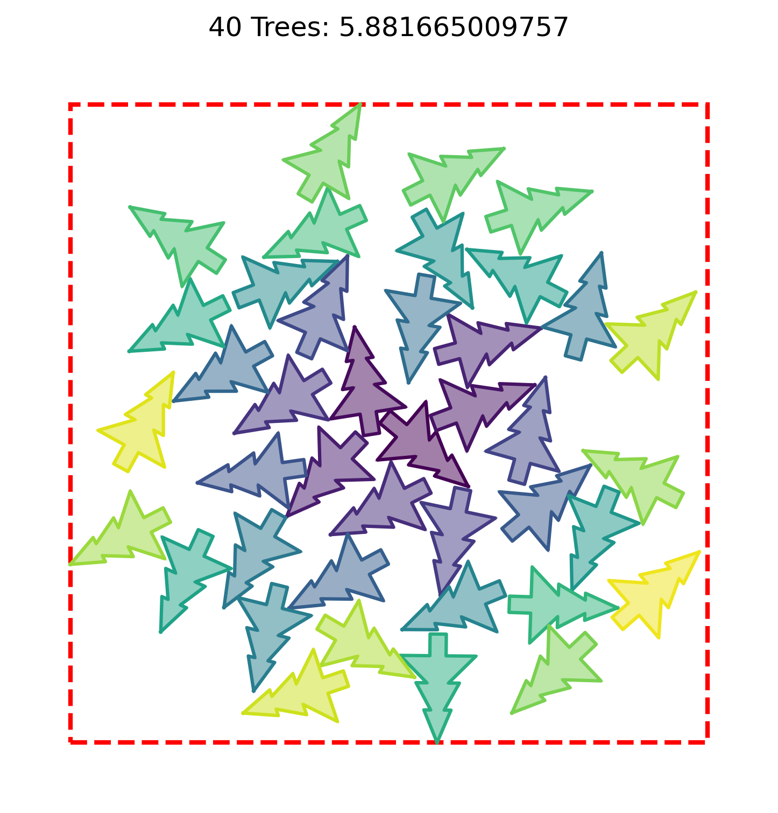

# Santa 2025 - Christmas Tree Packing Challenge

Source:
This repository implements a solution to Kaggle's
[Santa 2025 - Christmas Tree Packing Challenge](https://www.kaggle.com/competitions/santa-2025/overview),
based on the
[Getting Started](https://www.kaggle.com/code/inversion/santa-2025-getting-started)
and
[Metric](https://www.kaggle.com/code/metric/santa-2025-metric)
notebooks, both available under the
[Apache 2.0](https://www.apache.org/licenses/LICENSE-2.0)
open source license.


## Purpose

For each n from 1 to 200, pack n identical 2‑D Christmas‑tree shapes
(an "n-tree") into the minimal enclosing square. The figure below shows a
packing of 40 trees into a square of side length ≃ 4.1.



## Quick start

1. Ensure `pyenv` is installed; if needed, install Python 3.11.13:

    ```bash
    pyenv install 3.11.13
    ```

2. Create the virtual environment and install dependencies with `uv`:

    ```bash
    uv venv
    uv sync
    ```

3. Activate the virtual environment:

    ```bash
    source .venv/bin/activate
    ```

4. Run the main script to produce a `submission.csv`:

    ```bash
    python main.py
    ```

## Command-line parameters

The following parameters are supported by `main.py`:

- `--mlflow` : Enable MLflow logging. To open the MLflow UI, run:

    ```bash
    mlflow ui --port 5000 --backend-store-uri sqlite:///mlruns.db
    ```
- `--run-name` : MLflow run name (defaults to git commit or timestamp).
- `--draft` : Skip writing `submission.csv` (draft run).
- `--plot-every N` : Plot every N trees; use 0 to disable plotting. Default: 10.
- `--sizes SPEC` : Tree sizes to solve (e.g. "1-200", "1,3-7"). Default: 1-200.
- `--no-parallel` : Disable multiprocessing (useful for profiling).
- `--analyze [FILE]` : Run score analysis; accepts a file path or glob.
- `--profile` : Enable performance profiling.
- `--summary` : Plot summary statistics from `summary.csv`.
- `--strategy` : One of `brute`, `optuna`, or `hybrid` (default: hybrid).
- `--trials N` : Number of Optuna trials (default: 300).
- `--top N` : Number of top candidates to keep (default: 20).

## Core concepts and workflow

- Geometry: `ChristmasTree` and `NTree` implement placement and collision
    checks using Shapely and an `STRtree` spatial index.
- Tiles: star-topology tile patterns are constructed and validated. Minimal
    horizontal and vertical offsets (dx, dy) are found by a numerically
    guarded bisection routine.
- Evaluators: brute-force (discrete grid), Optuna (continuous), and hybrid
    (warm-start Optuna from discrete elites).

## Design highlights

- Deterministic construction and explicit validation (`ParticipantVisibleError`)
    support reproducible results.
- Collision handling treats touching as non-collision to permit tight
    packings; spatial indexing keeps checks scalable.
- Bisection search is tuned for numerical stability to avoid boundary
    sensitivity.
- Native floats and cached geometry transforms balance runtime performance
    with deterministic behavior.

## Repository overview

- `trees.py`: `ChristmasTree`, `NTree`, collision detection, and geometry
    helpers.
- `solver.py`: tile families, configuration builders, the bisection routine,
    tile metrics, pattern evaluators, and `Solver` orchestration.
- `solution.py`: `Solution` container, CSV serialization and validation.
- `plotter.py`: visualization helpers for per-n plots and score analysis.
- `main.py`: CLI, profiling, and optional MLflow integration.

## Submission format

Expected columns: `id` (`<n>_<index>`), `x`, `y`, `deg`.

Floating-point coordinates are written as strings prefixed with `s` (for
example `s0.1234`) to ensure they are preserved as strings in the output.

## Reproducibility and experimentation

- Use `--no-parallel` for deterministic profiling runs.
- Adjust `TileFamily` parameters in `solver.py` to explore alternate
    tilings.
- For fast iteration, reduce `--trials` or run `--strategy brute` first and
    then refine with `hybrid`.
